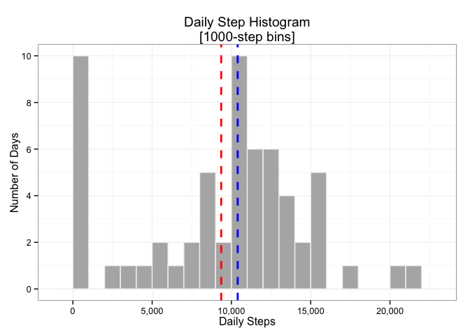
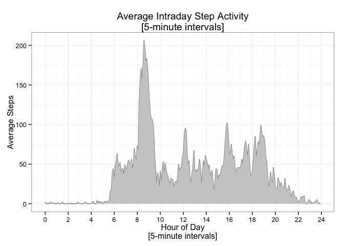
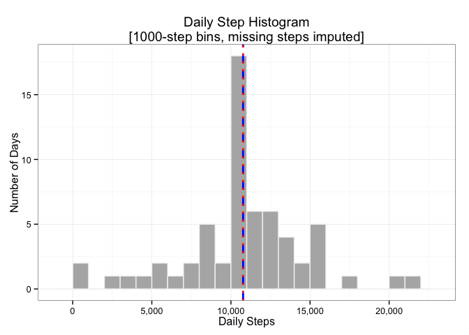
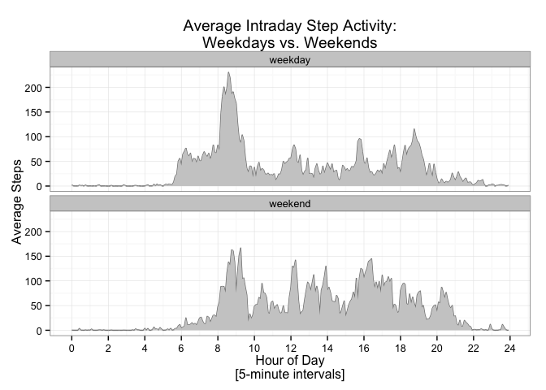

# Reproducible Research: Peer Assessment 1


## Loading and preprocessing the data
### 1. Load data
Below we unzip, load the activity data into a data.table, and preview the data.

```r
library(data.table)
# unzip and load activity data
if (!file.exists("activity.csv")) unzip("activity.zip")
dt <- fread("activity.csv")
# view data structure & 1st 15 rows to get feel for raw data
str(dt)
head(dt,15)
```

```
## Classes 'data.table' and 'data.frame':	17568 obs. of  3 variables:
##  $ steps   : int  NA NA NA NA NA NA NA NA NA NA ...
##  $ date    : chr  "2012-10-01" "2012-10-01" "2012-10-01" "2012-10-01" ...
##  $ interval: int  0 5 10 15 20 25 30 35 40 45 ...
##  - attr(*, ".internal.selfref")=<externalptr> 
##     steps       date interval
##  1:    NA 2012-10-01        0
##  2:    NA 2012-10-01        5
##  3:    NA 2012-10-01       10
##  4:    NA 2012-10-01       15
##  5:    NA 2012-10-01       20
##  6:    NA 2012-10-01       25
##  7:    NA 2012-10-01       30
##  8:    NA 2012-10-01       35
##  9:    NA 2012-10-01       40
## 10:    NA 2012-10-01       45
## 11:    NA 2012-10-01       50
## 12:    NA 2012-10-01       55
## 13:    NA 2012-10-01      100
## 14:    NA 2012-10-01      105
## 15:    NA 2012-10-01      110
```
### 2. Process data
From raw `date` and `interval` columns, add columns that are useful for grouping
by date, time of day, and day of week. Note that the raw `interval` column is 
misleading since the first two digits represent minutes while the remaining 
digits represent hours.  

```r
#convert date string to Date class
dt[,date:=as.Date(date,"%Y-%m-%d")]
# parse interval value and add datetime column (POSIXlt)
dt[,hour.of.day:= floor(interval / 100)] # hundreds represent hour in raw interval
dt[,minute.of.hour:= interval %% 100] # tens+units digits represent minutes of hour
# add fractional hour column for graphing time of day on continuous hours scale
dt[,hour.of.day.frac:= hour.of.day + minute.of.hour/60]
dt[,datetime:=as.POSIXlt(date) + (hour.of.day*60*60) + (minute.of.hour*60)]
# add day of week column as ordered factor variable w/ Monday as week's start
dt[,
   day.of.week:=
     factor(
          weekdays(dt$date),
          levels = c("Monday", "Tuesday", "Wednesday", "Thursday", "Friday", 
                     "Saturday", "Sunday"),
          ordered=TRUE)
     ]
```


## What is mean total number of steps taken per day?
* First, we get summary data sets for the daily step counts and mean/median for 
all days.  
* Then, we plot the daily step histogram with mean *(red)* and median *(blue)* lines.  

```r
library(dplyr, warn.conflicts=F,verbose=F) # for easy data manipulation/transformation
library(magrittr) # enables piping syntax with dplyr
library(ggplot2) # plotting
library(scales) # used for prettier scale formats

# using dplyr package,
#  1) group by date and sum steps
#  2) calc mean steps from daily step totals
daily.steps <- 
     dt %>%
          dplyr::group_by(date) %>%
          dplyr::summarize(daily.total=sum(steps, na.rm=T))
summary.steps <- 
     daily.steps %>%
          dplyr::summarize(daily.mean=round(mean(daily.total),0), 
                           daily.median=median(daily.total)
                          )
# plot histogram of daily steps with mean and median reference lines
ggplot(
     daily.steps,
     aes(daily.total)
     ) + 
     geom_histogram(binwidth=1000,fill="gray70",color="gray95") +
     scale_x_continuous(labels=comma) +
     scale_y_continuous(breaks=pretty) +
     theme_bw() +
     ggtitle("Daily Step Histogram\n[1000-step bins]") +
     xlab("Daily Steps") +
     ylab("Number of Days") +
     geom_vline( #mean line
          aes(xintercept=mean(daily.total, na.rm=T)),
          color="red", linetype="dashed", size=1) +
     geom_vline( #median line
          aes(xintercept=median(daily.total, na.rm=T)),
          color="blue", linetype="dashed", size=1)
```

 

* The **mean** daily steps *(red dashed line above)* is **9,354**.  
* The **median** daily steps *(blue dashed line above)* is **10,395**.  

## What is the average daily activity pattern?  
* First, we create a summary data set with average steps for each time interval 
of the day.  
* Then, we plot the line graph of average steps along the 24 hours in the day.  

```r
# get avg steps by time of day (5-min intervals)
intraday.avg.steps <-
     dt %>%
          dplyr::group_by(hour.of.day,minute.of.hour,hour.of.day.frac) %>%
          dplyr::summarize(avg.steps=round(mean(steps, na.rm=T),0))

#plot avg steps by time of day
ggplot(
     intraday.avg.steps,
     aes(x=hour.of.day.frac, y=avg.steps)) +
     geom_line(color="gray50") +
     geom_ribbon(fill="gray80",aes(ymin=0,ymax=avg.steps)) +
     scale_x_continuous(breaks=seq(from=0,to=24,by=2)) +
     theme_bw() +
     ggtitle("Average Intraday Step Activity\n[5-minute intervals]") +
     xlab("Hour of Day\n[5-minute intervals]") + ylab("Average Steps")
```

 

**The average daily activity spikes in the 8-9am hour, peaking at 8:35am.
The top 5 most active time intervals are listed below.**

```r
# show the 5 most active 5-minute intervals of the day in 24-hour time format
intraday.avg.steps %>%
     ungroup() %>%
     arrange(desc(avg.steps)) %>%
     transmute(
          time.of.day = sprintf("%02i:%02i", hour.of.day, minute.of.hour),
          avg.steps) %>%
     head(5)
```

```
##   time.of.day avg.steps
## 1       08:35       206
## 2       08:40       196
## 3       08:50       183
## 4       08:45       180
## 5       08:30       177
```
## Imputing missing values
### 1. How many rows have NA values?  What percentage of the rows?

```r
# rows with missing data
sum(!complete.cases(dt))
```

```
## [1] 2304
```

```r
# percentage rows w/ missing data
percent(sum(!complete.cases(dt))/nrow(dt))
```

```
## [1] "13.1%"
```
### 2. Create separate data set with steps imputed for missing values.
I decided to use the step averages for each interval to impute missing values 
because that metric will likely be the most versatile of any simple aggregate 
metric we could apply.  

```r
# 1) add overall mean steps for the row's interval value,
# 2) add flag to designate imputed step values
# 3) overwrite NA steps values with this overall group average,
# 4) remove the overall group average column
imputed.dt <- copy(dt) %>%
     group_by(interval) %>%
     mutate(
          i.steps=ifelse(is.na(steps),mean(steps,na.rm=T),steps),
          imputed=is.na(steps) ) %>%
     ungroup() %>%
     mutate(steps=i.steps, i.steps=NULL)
```

### 3. Plot revised histogram using imputed step values where they were missing.  
* First, we get summary data sets for the daily step counts and mean/median for 
all days, using data with imputed values.  
* Then, we plot revised daily step histogram with mean *(red)* and median *(blue)* lines.  

```r
# using dplyr package,
#  1) group by date and sum steps
#  2) calc mean steps from daily step totals
daily.steps.imputed <- 
     imputed.dt %>%
          dplyr::group_by(date) %>%
          dplyr::summarize(daily.total=sum(steps, na.rm=T) )
summary.steps.imputed <- 
     daily.steps.imputed  %>%
          dplyr::summarize(daily.mean=round(mean(daily.total),0), 
                           daily.median=median(daily.total) )

# plot histogram of imputed daily steps with mean and median reference lines
ggplot(
     daily.steps.imputed,
     aes(daily.total)
     ) + 
     geom_histogram(binwidth=1000,fill="gray70",color="gray95") +
     scale_x_continuous(labels=comma) +
     scale_y_continuous(breaks=pretty) +
     theme_bw() +
     ggtitle("Daily Step Histogram\n[1000-step bins, missing steps imputed]") +
     xlab("Daily Steps") +
     ylab("Number of Days") +
     geom_vline( #median line
          aes(xintercept=median(daily.total, na.rm=T)),
          color="blue", linetype="dashed", size=1) +
     geom_vline( #mean line
          aes(xintercept=mean(daily.total, na.rm=T)),
          color="red", linetype="dotted", size=1)
```

 

* The **mean** daily steps *(red dashed line above)* is 
 **10,766**.  
* The **median** daily steps *(blue dashed line above)* is
 **10,766**.  
* The distribution is now much more concentrated at the raw mean (ignoring NAs) 
because there are 8 full days out of the 61 total that are missing values. 
* The median is now the same as the mean because all missing days take on
the daily mean value.  
* Only the histogram bin containing the mean changes from the original because 
all rows for any given date are either completely missing or fully complete.  

## Are there differences in activity patterns between weekdays and weekends?  
### 1. Make a factor variable representing whether the date occurs on a weekday or weekend.

```r
# add factor variable indicating whether observation was weekend or weekday
imputed.dt <- imputed.dt %>%
     mutate(weekday.or.weekend =
                 factor(
                      day.of.week %in% c("Saturday","Sunday"), 
                      labels=c("weekday","weekend")
                      ) )
```

### 2. Plot average steps by time of day, grouped by weekdays and weekends.

```r
# create a summary data table of avg steps by weekday/weekend and time interval
day.of.week.group.avg.steps <- imputed.dt %>%
     group_by(weekday.or.weekend, interval, hour.of.day.frac) %>%
     mutate(avg.steps=mean(steps))

#plot avg steps by time of day
ggplot(
     day.of.week.group.avg.steps,
     aes(x=hour.of.day.frac, y=avg.steps)) +
     facet_wrap(~ weekday.or.weekend, nrow=2,ncol=1) +
     geom_line(color="gray50") +
     geom_ribbon(fill="gray80",aes(ymin=0,ymax=avg.steps)) +
     scale_x_continuous(breaks=seq(from=0,to=24,by=2)) +
     theme_bw() +
     ggtitle("Average Intraday Step Activity:\nWeekdays vs. Weekends") +
     xlab("Hour of Day\n[5-minute intervals]") + ylab("Average Steps")
```

 
  
**Weekend activity tends to:**  

* start a later in the morning than weekdays.  
* fluctuate less througout the day than weekdays.  
* continue later into the night than weekdays.  
